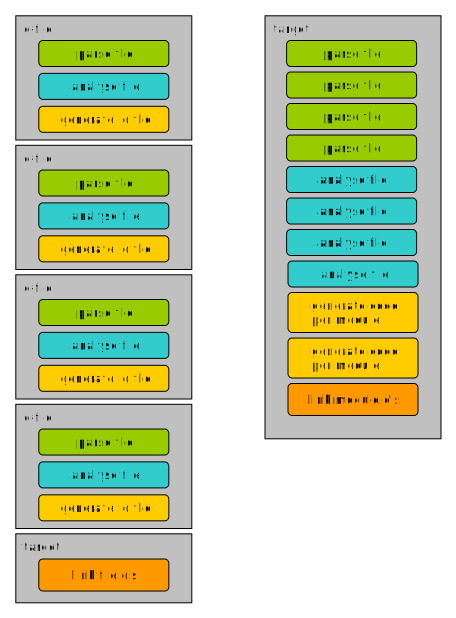
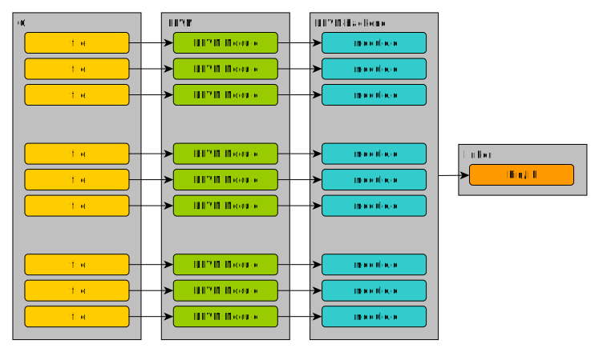
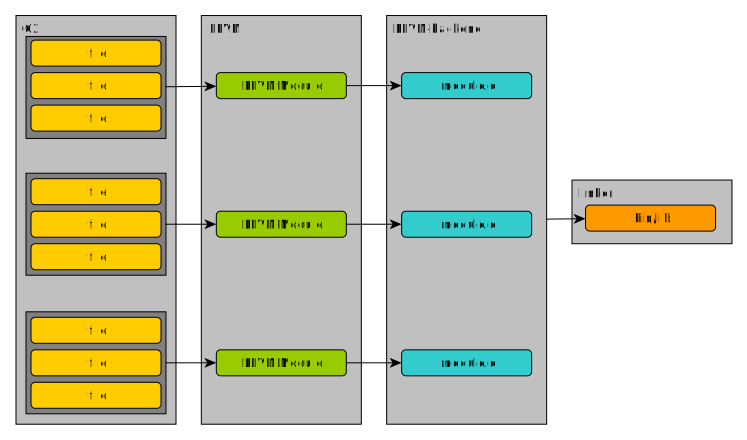
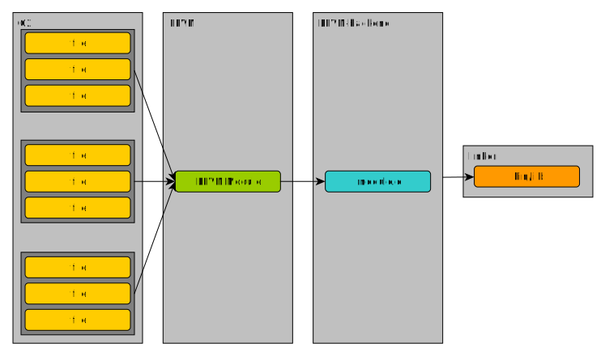

__NOTE:
While this might be seen as critique of C, it is not. C is an
awesome language that has survived the test of time for more than 40 years!
Respect to its designer...__

*"Evolution consists of mutation and selection.."*

In other words, we __change the bad__ things and __keep the good__ things of C.

Things that are seen as *bad* nowadays and can be improved:

- header-file includes.
- complex/un-readable type syntax
  (can you read ```char *(*(**foo [][8])())[];```? see the bottom of the page for the correct answer)
- very hard for tooling
- needs an external build system

C was designed in an era when the compiler had to work with very limited processing
power and memory. Nowadays, these restrictions simply don't apply anymore and it would
be better to put more work into the compiler instead of onto the developer.

One of the major show-stoppers in C is the use of header file includes. The clang
website has a [very nice article](http://clang.llvm.org/docs/Modules.html#problems-with-the-current-model) on
the problems of #include.
Because #includes are recursive, the compiler often has to parse and analyse a lot more
then just your code. Tests on regular C code have shown the factor of user code / external code
to be roughly 1 to 50. So for every line of code you write, the compiler needs to parse and
analyse 50 lines!

Additionally, frequent use of preprocessor macros gives headaches to tool developers
and code analysers.

## overview of changes
This section describes the main differences between C and C2.

### no header files
C2 uses a modern approach for usage of external symbols. There is only one type
of files, the **.c2** source files. To replace the ```#include```, there is an __import__
statement. Also all source code is divided into [Modules](../language/modules.md).

__no mandatory declaration ordering__

There are no *forward declarations* in C2 of any kind. Each declaration is just
defined in a single place. This implies that there are no ordering requirements
of any kind within a source file. That means that top level declarations can be
written in any order, which allows the programmer to sort their declaration in a
way that suites them and their needs the most rather than the way the compiler
dictates as it is with C. The example below is valid:

```c
// type Number and global variable n are used here
func void add(Number a) { total += a; }

// type Number is used here
Number total = 10;

// type is only defined here
type Number int32;
```

### integrated build system
Integrating the build system into the compiler may seem restrictive, but it actually
enables a lot of improvements. See [this page](../build_system/intro.md) for a
description of the build system.

C2C uses a multi-pass analyser that analyses a complete program in multiple passes.
The image below show the difference between traditional C compilation and C2 compilation.


In C, the compiler is called separately for each .c file and asked to parse and
analyse it, then generate the object code. Afterwards, all object files are linked
into an executable or a library.

In C2, all files are first parsed, then analysed in successive passes.
Only when there are no errors is the code generation started.

The code generation (and optimization) steps require a lot of time. So if you have
100 C source files and the 99th file has a syntax error, the compiler has to go through
a lot of work before showing the diagnostic. In C2 it only takes very little time.
So during development, developers never have to wait for diagnostic messages.

### compilation per target, not file
One feature the integrated build system offers is an easy way for developers to
have control over how their code is built. Traditionally, C programs are compiled
as follows:

So each source file is turned into an LLVM module (IR code). The LLVM module is the
scope for the optimization pass. Then object code is generated (the **.o** file), which means
the optimizer passes only get a single piece of the puzzle each time.

In C2 the developer can choose between 2 modes: single module or multiple modules.
In multi-modules mode (the default), all source files within the same C2 module are
turned into a single LLVM module (see below). The optimizer pass already has a bigger
piece of the puzzle now, a whole C2 module.


To allow even more optimization, C2 can convert all sources into a single LLVM
module, allowing full 'LTO' (link-time optimization). Enabling LTO or 'whole program
optimization' in C is very hard for any realistic size project. In C2 it can be easily
enabled in the recipe file.


Also the *visibility* of the symbols in the resulting binary can be easily controlled
without the use of linker scripts or special tools as described in the
[Export control section](../build_system/symbols.md).

For more information on targeting and the build system,
please visit [Build system section](../build_system/symbols.md).

### built-in primitive types
C2 provides the following built-in primitive types:

* __bool__
* __int8__, __int16__, __int32__, __int64__
* __uint8__, __uint16__, __uint32__, __uint64__
* __float32__, __float64__
* __char__ (equal to int8)

The default __int__ and __float__ types have been removed along with type modifiers such as
__short__, __long__, __signed__, or __unsigned__.

The `NULL` macro, has been replaced by the __nil__ keyword.

### uniform type (definition) syntax
Type definitions in C are sometimes hard to read. Also the syntax is a bit weird with
the typedef's. C2 provides uniform syntax to define new types, as shown
[here](../language/user_types.md).

### stricter diagnostics
A lot of projects in C lose quite some time tweaking the warning levels. Getting optimal
diagnostics from a C compiler requires passing it a lot of options.

The C2 language only uses a few warnings (mostly about unused import/type/var/function/etc).
All the other diagnostics are simply an error.
Examples of errors in C2:

* using an uninitialized variable
* not returning anything from non-void function
* some type conversions

Thanks to the stricter diagnostics, c2c tells you where exactly the error is located,
what kind of error is it, as well as showing a possible fix in some cases, for example for
a missing semicolon after a function call. Again, this speeds up development time, because
you don't need to frantically search for the root of your problem for as much time as in C.

### attributes
The C2 language design includes [attributes](../language/attributes.md). Out of the box,
C2 supports standardized attributes. Compiler-specific ones are also still available. This simplifies
the development of multi-platform code.

### tooling
C2C's functionality as a parser can also be used by other tools.
One example of this is *c2reto*, C2's refactor tool.

### special features
C2 also introduces some new features:

* [incremental arrays](../language/variables.md#incremental-arrays)
* [c2 pseudo-module](../build_system/c2module.md)


#### correct answer for the type declaration above
foo is an array of arrays of 8 pointers to pointers to a function returning a pointer to an array of char pointers.
